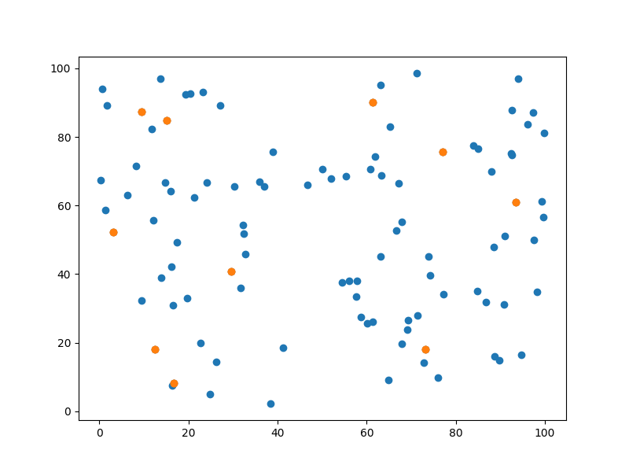

# K-means clustering algorithm in python
## Introduction
[K-means](https://en.wikipedia.org/wiki/K-means_clustering) algorithm is used for clustering a sample of data into k partitions. It emphasizes that, the [euclidean distance](https://en.wikipedia.org/wiki/Euclidean_distance) between a point and its corresponding cluster centre is minimized. The cost function that k-means try to minimize is the summation of distance of each point adn its corresponding centre.

## Algorithm
 - <b>Step 1</b>: Initialize the centres as `k` random points from the sample of size `n`.
 - <b>Step 2</b>: Assign each data point to the cluster centre closest(euclidean distance) to it.
 - <b>Step 3</b>: Find the mean(centroid) of each cluster and assign this as the new center.
 - <b>Step 4</b>: Repeat from <b>Step 2</b> until this algorithm converge.

## Complexity
`O(n^2)`: As we are processing a 2-D input matrix. Also, it highly depends on the type of dataset is. Usually on most of the datasets, the algorithm <u>converges</u> very quickly.

## Pseudo code
```
choose k random points from the sample

in each iteration:
    for each point in the sample:
        assign it to the closest cluster centre

    for each cluster:
        find the mean of this cluster
        assign this as the new cluster centre
        
    terminate if old centres are identical to new centres
```

## Illustration on uniform data


## How to run?
 - `make run`   : Running the algorithm on sample input
 - `make draw`  : Drawing on matplotlib
